# Sandy Bay
Please note: You start the game facing **south**. For other entrypoints into Sandy Bay, see the [directional guide](#sandy-bay-directional-guide) at the end of this document.

The **Beachside** golden brick is located on a hidden area west of the north beach's west ramp.
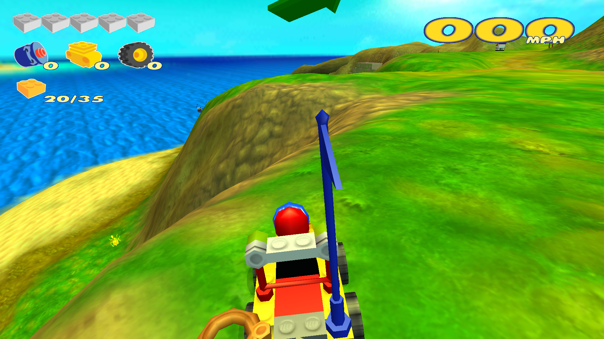

The **Cliffside** golden brick is located on a cliff overlooking the north beach.
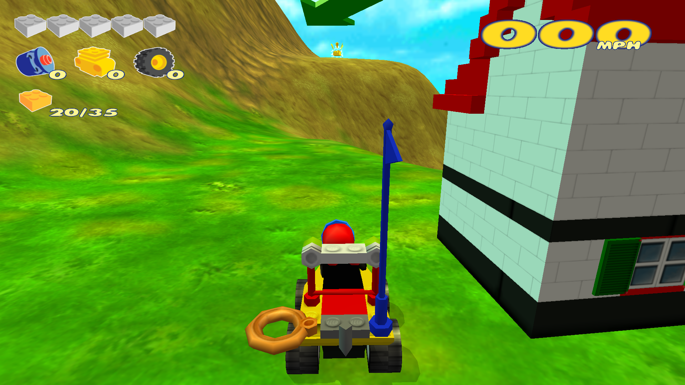

The **Mountain** golden brick is located on the east side of the mountain to the east of town.
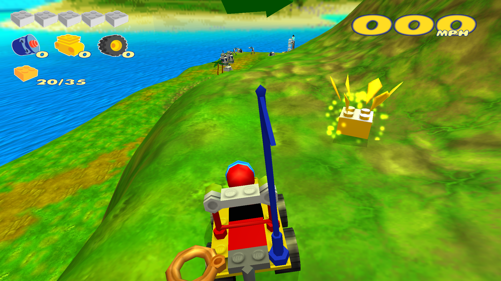

# Dino Island
Please note: You enter exploration of Dino Island facing slightly to the left of **west**.

The **Plateau** golden brick is located on the north side of the plateau path, overlooking the village.
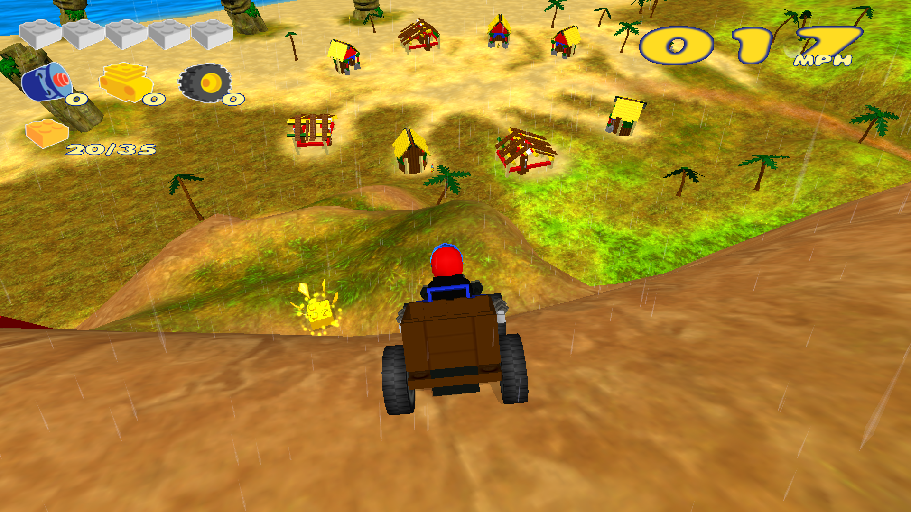

The **Oceanside** golden brick is located to the northwest of the village, north of a cluster of palm trees, overlooking the ocean.
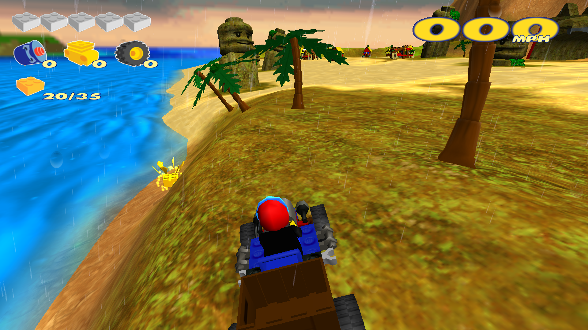

The **Jungle** golden brick is located atop the volcanic temple's southern entrance, in the jungle.
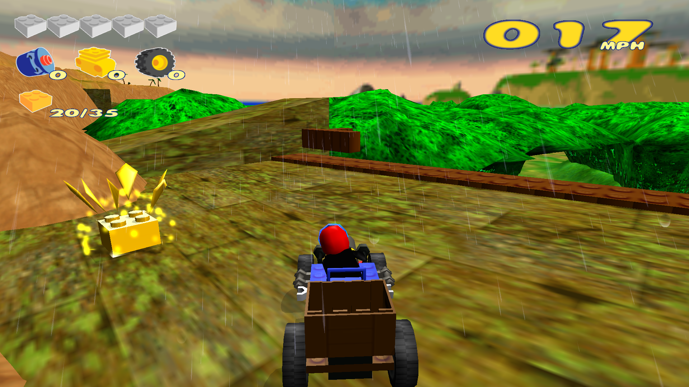

# Mars
Please note: You enter exploration of Mars facing slightly to the right of **south**.

The **Powerstore** golden brick is hidden in a pile of boulders within the watery cave on the southeast corner of the map.
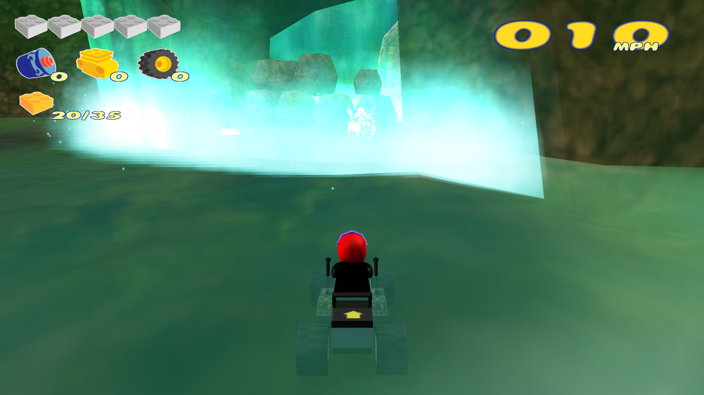

The **Gold Mine** golden brick is located on the southwest side of the gold mine, in the northeast corner of the map.
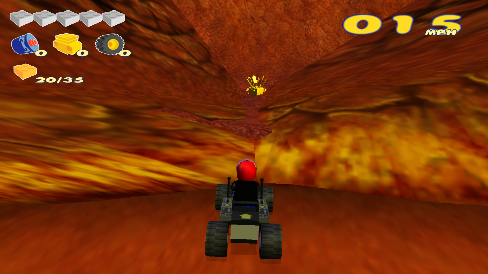

The **Alien Base** golden brick is located on the southwest edge of the alien base, just inside the big, sweeping curve around its edge.
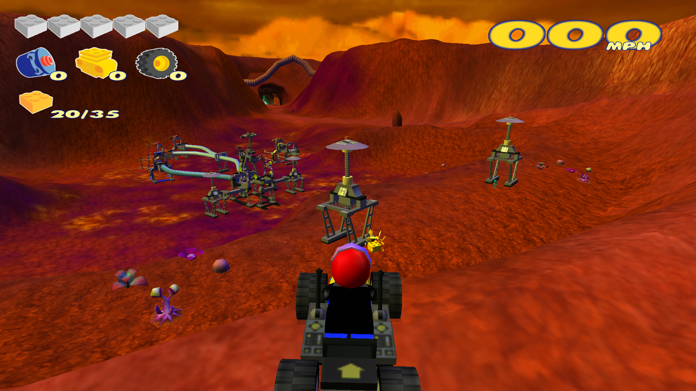

# Arctic
Please note: You enter exploration of the Arctic facing slightly to the left of **east**.

The **Crash Site** golden brick is located in the wreckage of a plane crash to the east of the exploration spawn point.
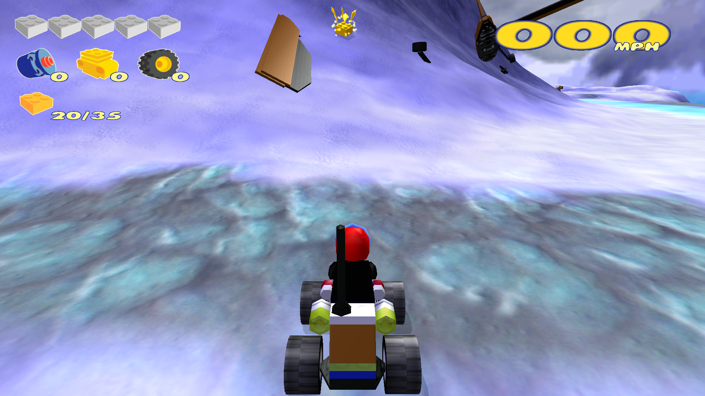

The **Trapped Ship** golden brick is located aboard the trapped ship, on its south side (probably the starboard side of the ship).
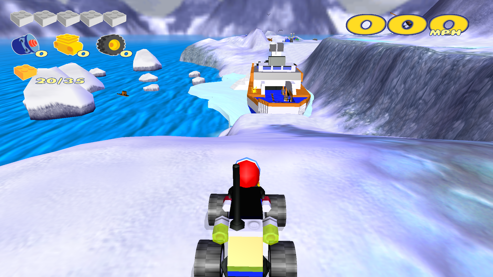

The **Base Camp** golden brick is hidden within boxes on the west side of the base camp that the bonus games start in.
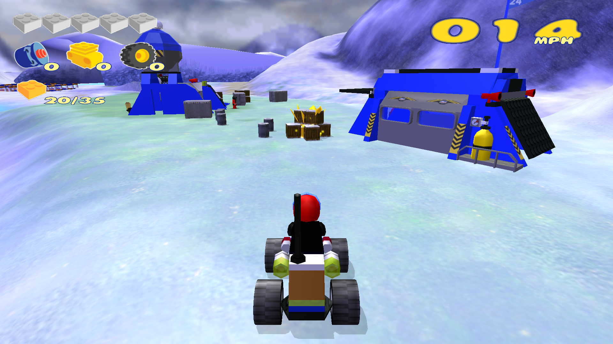

# Xalax
Please note: You enter exploration of Xalax facing slightly to the left of **west**. Additionally, the Golden Bricks can be found only during exploration or the Wheeled Warriors racetrack.

The **Tubeside** golden brick is located straight ahead when you start exploring, on the south side of the forcefield tube.
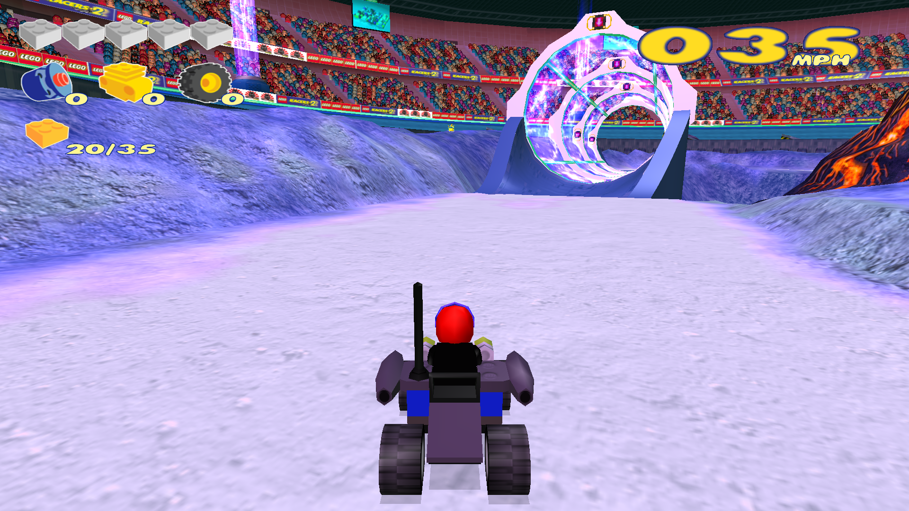

The **Jump Ramp** golden brick is located just behind the takeoff (south) ramp of the jump.
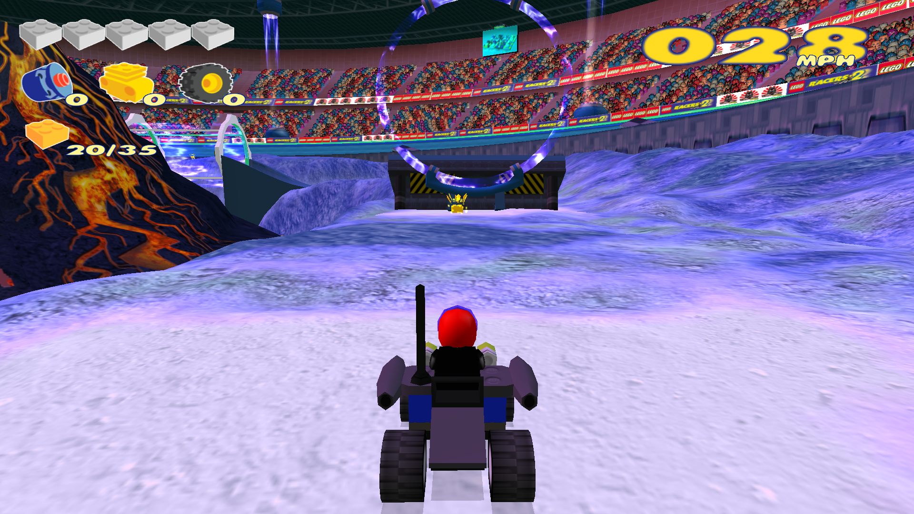

The **Dormant Volcano** golden brick is located on the north side of the dormant volcano, north of the loop.
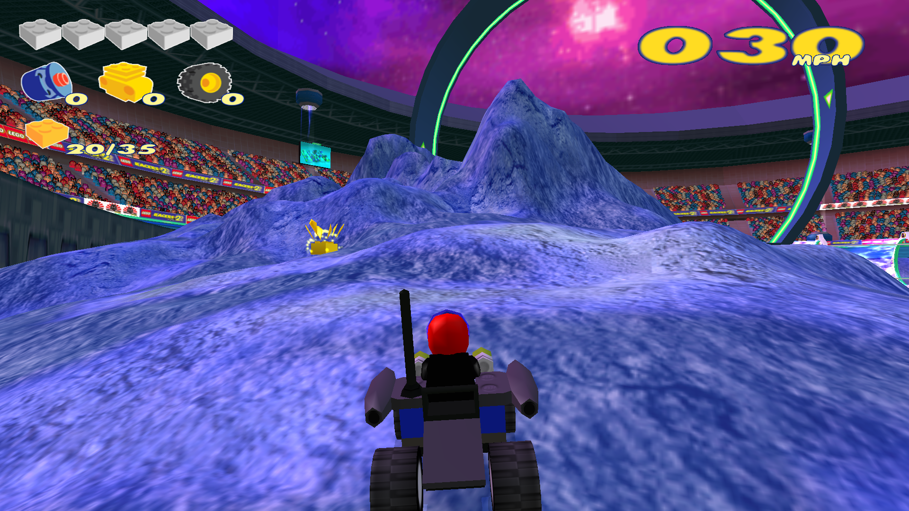

# Sandy Bay Directional Guide
| When you return to Sandy Bay from...       | You are facing ...          |
| :----------------------------------------- | :-------------------------- |
| The start of the game                      | Directly south              |
| Dig-A-Brick (Workman Fred's race)          | West-northwest              |
| Express Delivery (Mike the Postman's race) | Slightly left of west       |
| Hot Stuff (Fireman Gavin's race)           | Slightly left of south      |
| Bobby's Beat (PC Bobby's race)             | Directly southwest          |
| The mountaintop bonus game                 | Slightly right of northwest |
| The oceanside bonus game                   | Slightly right of north     |
| Dino Island                                | Slightly left of east       |
| Mars                                       | North-northwest             |
| Arctic                                     | Slightly right of south     |
| Xalax                                      | East-southeast              |
